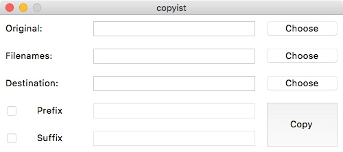

# copyist
Mass-copy one file.

Ever needed to copy a single file multiple times but with different names? This utility might help.

## Usage:
1. Choose a file to copy.
2. Then choose a .txt file with line-separated names. Filenames shouldn't contain a file extension.
3. And finally choose a destination folder for copying.
4. Optionally you can add a prefix or suffix to every file as well.

